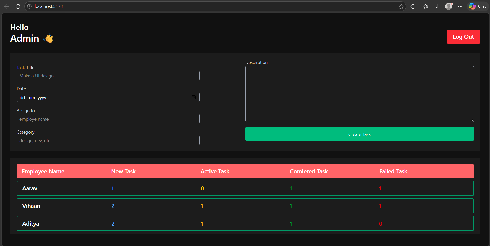
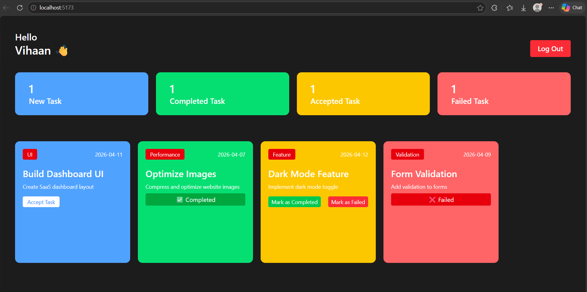

# 📋 Employee Task Management System

A React-based task management app where an **Admin** assigns tasks to employees, and **Employees** can accept, complete, or fail their tasks — with live updates across both dashboards.

---

## 🌐 Live Demo

🔗 [Click here to view the live app](https://your-deployed-link.com)

---

## 📸 Screenshots

### 🔐 Login Page


### 👨‍💼 Admin Dashboard


### 👷 Employee Dashboard


### 📝 Create Task


---

## 🎨 Task Card Colors

| Status       | Color  |
|--------------|--------|
| 🔵 New Task  | Blue   |
| 🟡 Accepted  | Yellow |
| 🟢 Completed | Green  |
| 🔴 Failed    | Red    |

---

## 👤 Login Credentials

**Admin:**
- Email: `admin@me.com`
- Password: `123`

**Employees:**
| Name    | Email                 | Password |
|---------|-----------------------|----------|
| Aarav   | employee1@example.com | 123      |
| Vihaan  | employee2@example.com | 123      |
| Aditya  | employee3@example.com | 123      |
| Krishna | employee4@example.com | 123      |
| Ishaan  | employee5@example.com | 123      |

---

## 🛠️ Tech Stack

- **React** — UI and components
- **React Context API** — shared global state
- **Tailwind CSS** — styling
- **localStorage** — session persistence

---

## 📦 Getting Started

```bash
# Clone the repo
git clone https://github.com/your-username/your-repo-name.git

# Install dependencies
npm install

# Start the dev server
npm run dev
```

Open [http://localhost:5173](http://localhost:5173) in your browser.
